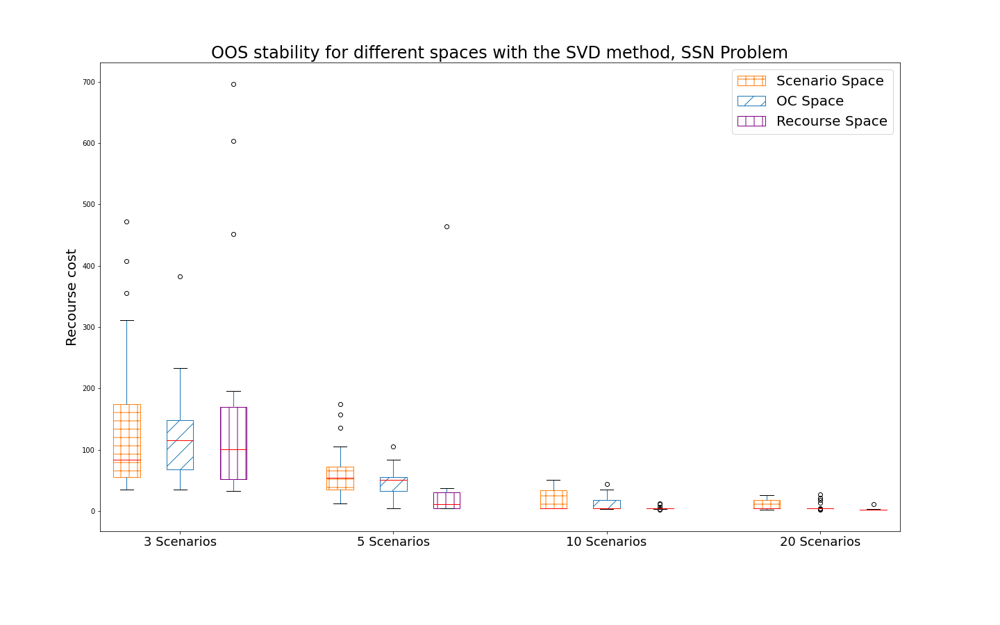
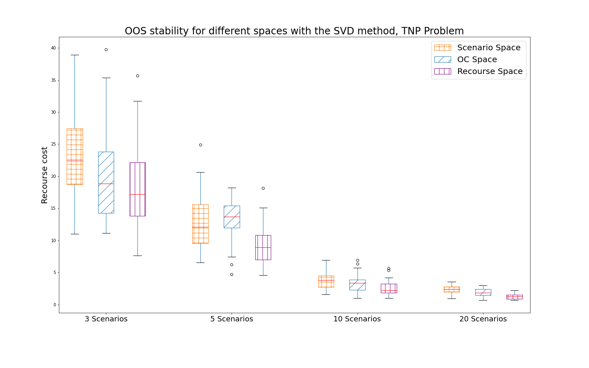
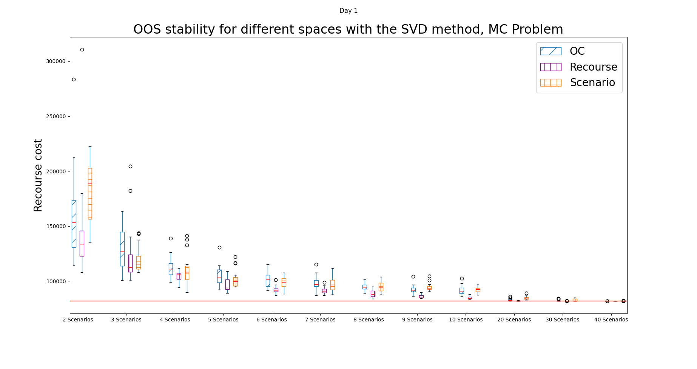
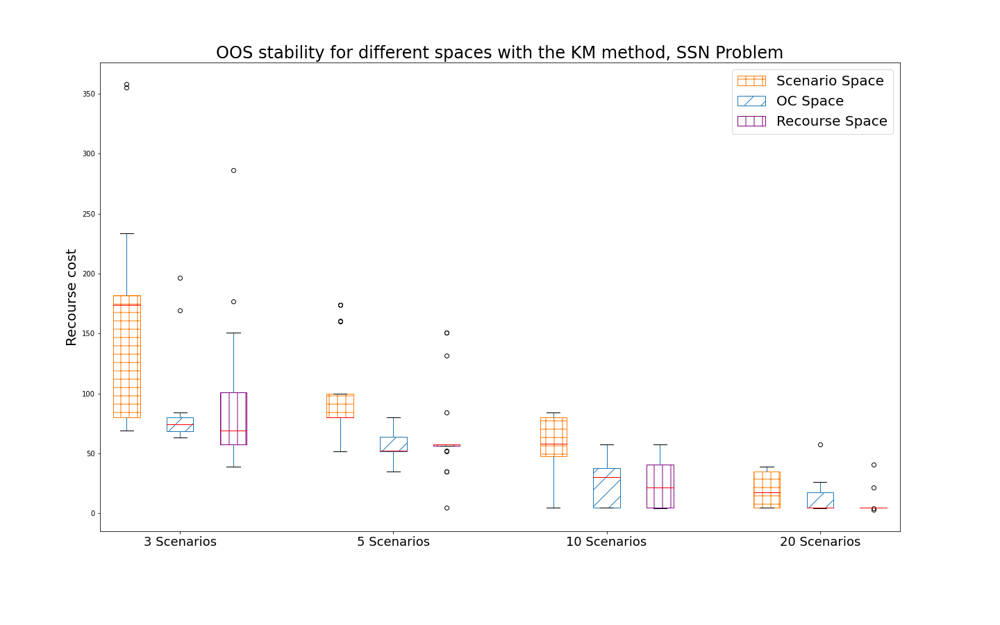
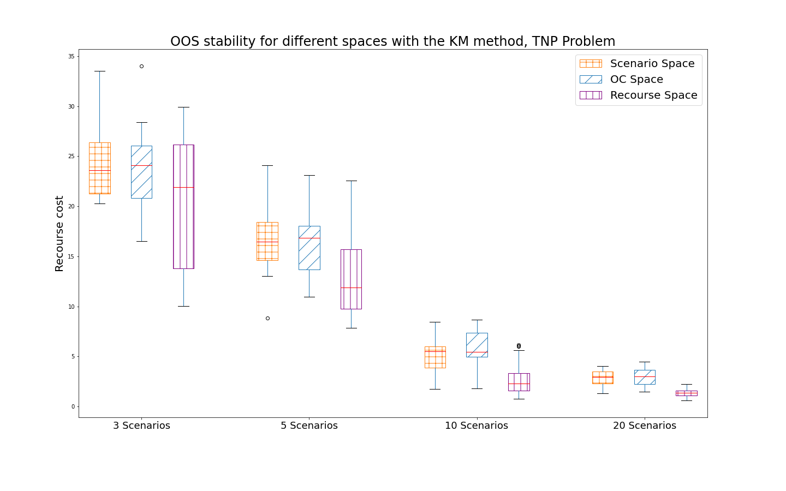
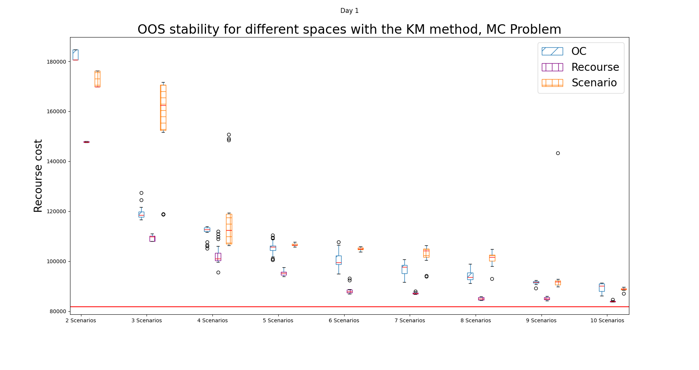
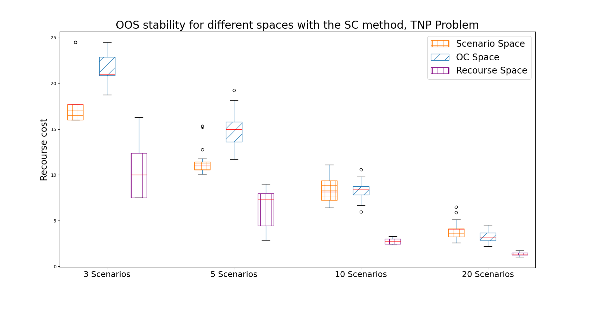

# Scenario reduction using the recourse space - Supplementary material
## Additional plots of results

Below we see the out-of-sample (OOS) results for the three different methods (SVD, KM, SC) and the three different problems (SSN, TNP, MC). Each plot shows the OOS results for the given method and problem for the three different spaces (scenario space, OC space, and recourse space) for an increasing number of scenarios.

Tap on a plot to zoom in.

|| SSN problem             |  TNP problem | MC problem |
:-------------------------:|:-------------------------:|:-------------------------:|:-------------------------:
**SVD** |  |   | 
**KM** |  |   |  
**SC** |  |   |  
